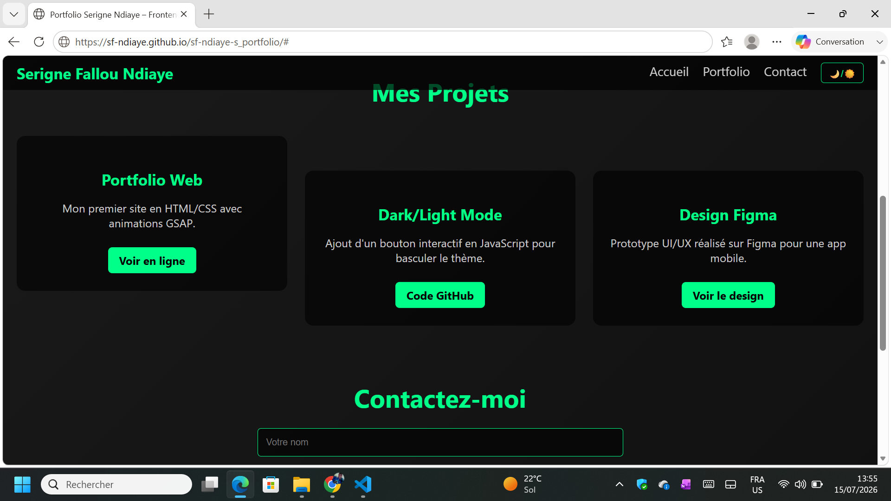

# 🌐 Portfolio - Serigne Fallou Ndiaye

Bienvenue sur mon portfolio web !  
Ce projet présente mes compétences en **HTML/CSS**, **JavaScript**, et mes premiers pas avec **GSAP** et **Figma**.

## 🚀 Démo en ligne
👉 [Voir le site](https://sf-ndiaye.github.io/sf-ndiaye-s_portfolio)

## 📂 Projets inclus
- **Portfolio Web** : HTML/CSS avec animations GSAP  
- **Dark/Light Mode** : bouton interactif en JavaScript  
- **Design Figma** : prototype UI/UX WhatsApp  

## 🛠️ Technologies utilisées
- HTML / CSS  
- JavaScript  
- Git & GitHub  
- Figma  

## 📸 Aperçu

## 📧 Contact
- LinkedIn : [Mon profil](https://www.linkedin.com/in/serignefalloundiaye)  
- Email : fallou97ndiaye@gmail.com
